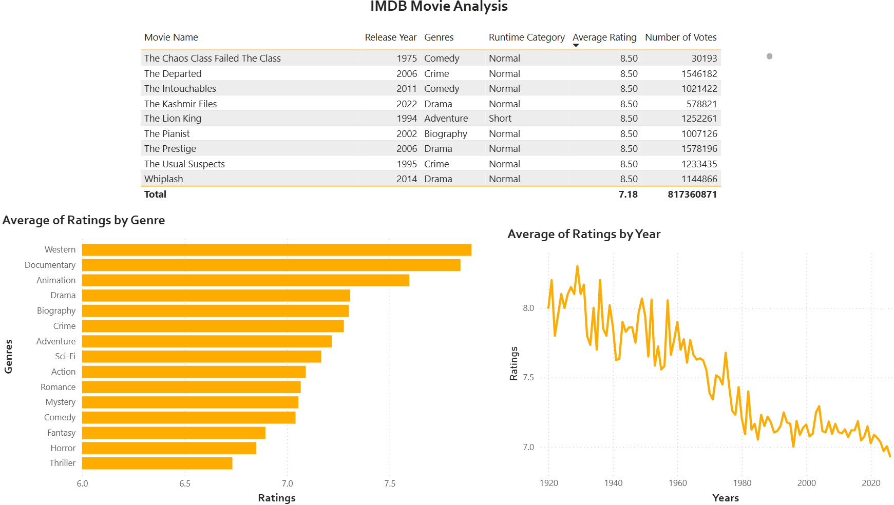

# IMDb-Movie-Data-Analysis
This is my very first Power BI project. I used an IMDb dataset to explore how movie ratings change based on their genres and release years. My goal was to practice data cleaning and basic visualization.

## What I Did (Data Cleaning)
The raw dataset was a bit messy. Before making any charts, I used Power Query to clean the data:
- **Simplified Genres & Directors:** Movies often had multiple genres (like "Action, Adventure, Sci-Fi"). To avoid messing up the data model and calculations, I split these columns by the comma delimiter and kept only the Primary Genre and Primary Director.
- **Cleaned Text:** Removed weird characters (like `*`) from movie titles using the "Replace Values" feature without deleting the actual rows.
- **Created Categories:** I wrote a custom rule to group movies into "Short", "Normal", and "Very Long" categories based on their runtime minutes.

## What I Found (Insights)
- **Ratings are dropping over time:** My line chart shows a clear downward trend in average movie ratings from the 1920s to today. Why? Back then, there were fewer movies, making each release feel special and impactful. Today, the market is flooded with endless movies. Audiences have much higher expectations, endless options to compare, and are simply harder to impress.
- **Top Genres:** Westerns and Documentaries actually have the highest average ratings in this dataset, scoring much higher than popular genres like Action or Thriller.

## The Dashboard
Here is a screenshot of my final Power BI dashboard:

